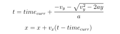

# Game
## Program Overview
* My AI agent keeps track of the unsafe zones using an array of size w (same size as the width of the game screen) using binary values (1 - Unsafe, 0 - Safe). At every time instant:
     * Any explosions taking place at the current time instant are marked unsafe by accessing the list of explosions struct using an instance of the game class.
     * Projectile motion is tracked using equations of motion:
     
        
        
        With this information I predict when and where a projectile will fall ahead of time. Giving a buffer for the agent to move when a spot becomes unsafe prior itself, I mark the corresponding spots unsafe.
     * Depending on the safe spots and the current location of the agent, if it is at a safe spot, the agent remains there, otherwise, I check if the closest safest spot is in the left or right and move in that direction by player speed, owing to kinematic constraint.

## Debugging Challenges
* I made a mistake in calculating position of the projectile and hence was facing issues in moving the agent to the desired location.
* Another  mistake  I  made  was  not  realizing  what  pickSafeSpot  function  returns.I  assumed  it  can  return  float  and  hence  was  not  able  to  impose  the  kinematic constraint

## Survival in Hard Scenario
My algorithm does not survive in the hard scenario. Depending on the initial position of the player, survival rates are different. This is because I am being overly conservative in terms of the buffer I am giving for position and time. Thus in hard case, at the rate at which the projectiles are being fired the agent dies soon as it tries to move in one direction assuming it is safe and in the next time instant it might have to move in the opposite direction. If the buffer was a little less constrained, it may be able to make quicker decisions in moving to safe locations

## Assignment goals
The assignment was helpful in understanding segmentation faults, namescopes and multiple file inclusions within a program. It gave me a good practical understanding of different cpp and oops concepts, and I had only a theoretical understanding of some concepts. Also, the agent was able to suvive on its own in easy and medium for more than a minute and hence I believe it did meet its goals.
